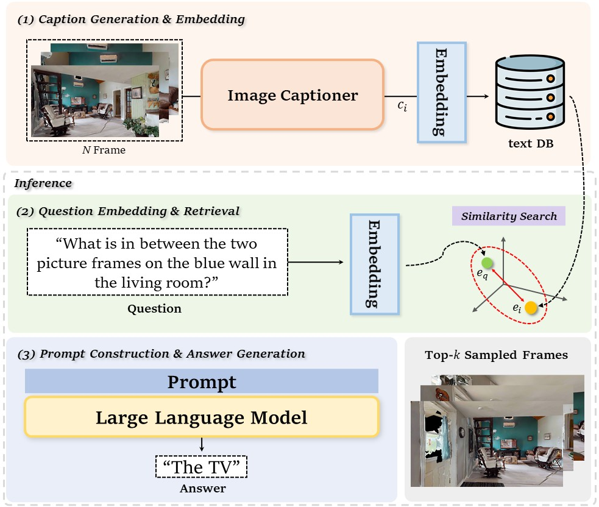

<div align="center">
<h2>R-EQA: Retrieval-Augmented Generation for Embodied Question Answering</h2>

[**Hyobin Ong**](https://scholar.google.co.kr/citations?user=_7yFVacAAAAJ&hl=ko)<sup>1,2</sup> [**Minsu Jang**](https://zebehn.github.io/)<sup>1,2†</sup>

<sup>1</sup>UST <sup>2</sup>ETRI

†corresponding author

**CVPR 2025 EmbodiedAI workshop Accepted Paper Highlights**

[paper TBD]()


</div>

This source can be used for experiments with the openEQA benchmark. Please follow the setup instructions provided by openEQA.

# openEQA setup
<details>
<summary>openEQA</summary>

# OpenEQA: Embodied Question Answering in the Era of Foundation Models

[[paper](https://open-eqa.github.io/assets/pdfs/paper.pdf)]
[[project](https://open-eqa.github.io/)]
[[dataset](https://www.notion.so/data)]
[[bibtex](https://www.notion.so/CVPR-workshop-19dcf3c4d54a80229c65dbd0e6aa690f?pvs=21)]

https://github.com/facebookresearch/open-eqa/assets/10211521/1de3ded4-ff51-4ffe-801d-4abf269e4320

## Abstract

We present a modern formulation of Embodied Question Answering (EQA) as the task of understanding an environment well enough to answer questions about it in natural language. An agent can achieve such an understanding by either drawing upon episodic memory, exemplified by agents on smart glasses, or by actively exploring the environment, as in the case of mobile robots. We accompany our formulation with OpenEQA – the first open-vocabulary benchmark dataset for EQA supporting both episodic memory and active exploration use cases. OpenEQA contains over 1600 high-quality human generated questions drawn from over 180 real-world environments. In addition to the dataset, we also provide an automatic LLM-powered evaluation protocol that has excellent correlation with human judgement. Using this dataset and evaluation protocol, we evaluate several state-of-the-art foundation models including GPT-4V, and find that they significantly lag behind human-level performance. Consequently, OpenEQA stands out as a straightforward, measurable, and practically relevant benchmark that poses a considerable challenge to current generation of foundation models. We hope this inspires and stimulates future research at the intersection of Embodied AI, conversational agents, and world models.

## Dataset

The OpenEQA dataset consists of 1600+ question answer pairs $(Q,A^*)$ and corresponding episode histories $H$.

The question-answer pairs are available in [data/open-eqa-v0.json](https://www.notion.so/data/open-eqa-v0.json) and the episode histories can be downloaded by following the instructions [here](https://www.notion.so/data).

**Preview:** A simple tool to view samples in the dataset is provided [here](https://www.notion.so/viewer).

## Baselines and Automatic Evaluation

### Installation

The code requires a `python>=3.9` environment. We recommend using conda:

```bash
conda create -n openeqa python=3.9
conda activate openeqa
pip install -r requirements.txt
pip install -e .

```

### Running baselines

Several baselines are implemented in [openeqa/baselines](https://www.notion.so/openeqa/baselines). In general, baselines are run as follows:

```bash
# set an environment variable to your personal API key for the baseline
python openeqa/baselines/<baseline>.py --dry-run  # remove --dry-run to process the full benchmark

```

See [openeqa/baselines/README.md](https://www.notion.so/openeqa/baselines/README.md) for more details.

### Running evaluations

Automatic evaluation is implemented with GPT-4 using the prompts found [here](https://www.notion.so/prompts/mmbench.txt) and [here](https://www.notion.so/prompts/mmbench-extra.txt).

```bash
# set the OPENAI_API_KEY environment variable to your personal API key
python evaluate-predictions.py <path/to/results/file.json> --dry-run  # remove --dry-run to evaluate on the full benchmark

```

## License

OpenEQA is released under the [MIT License](https://www.notion.so/LICENSE).

## Contributors

Arjun Majumdar*, Anurag Ajay*, Xiaohan Zhang*, Pranav Putta, Sriram Yenamandra, Mikael Henaff, Sneha Silwal, Paul Mcvay, Oleksandr Maksymets, Sergio Arnaud, Karmesh Yadav, Qiyang Li, Ben Newman, Mohit Sharma, Vincent Berges, Shiqi Zhang, Pulkit Agrawal, Yonatan Bisk, Dhruv Batra, Mrinal Kalakrishnan, Franziska Meier, Chris Paxton, Sasha Sax, Aravind Rajeswaran

## Citing OpenEQA

```
@inproceedings{majumdar2023openeqa,
  author={Arjun Majumdar, Anurag Ajay, Xiaohan Zhang, Pranav Putta, Sriram Yenamandra, Mikael Henaff, Sneha Silwal, Paul Mcvay, Oleksandr Maksymets, Sergio Arnaud, Karmesh Yadav, Qiyang Li, Ben Newman, Mohit Sharma, Vincent Berges, Shiqi Zhang, Pulkit Agrawal, Yonatan Bisk, Dhruv Batra, Mrinal Kalakrishnan, Franziska Meier, Chris Paxton, Sasha Sax, Aravind Rajeswaran},
  title={{OpenEQA: Embodied Question Answering in the Era of Foundation Models}},
  booktitle={{CVPR}},
  year={2024},
}

```

</details>


Once the openEQA setup is complete, including ScanNet and HM3D, you can run the pipeline as follows:

# setup
First, generate image captions and embeddings for all frames.
(Note: The arguments should be adjusted according to the user’s needs. And this step may take a significant amount of time, as it involves captioning every frame.)

```
# image captioning
python openeqa/baselines/captioning_qwen.py

# embedding
python extract_emb.py

```

# inference
Second, embed each question from `data/open-eqa-v0.json` and compute the cosine similarity with the embeddings of the episode history.

Finally, convert the top-3 most similar captions into natural language and parse them as in-context examples for the LLM input prompt.

```
# using RAG
python openeqa/baselines/llama_rag.py

# using Uniform Sampling
python openeqa/baselines/llama_uniform_sampling.py

```

# Evaluation
Evaluation is performed using `evaluate-predictions.py` provided by openEQA.

# FAQ
Please feel free to contact us (ohnghb@etri.re.kr) with any question or concerns.